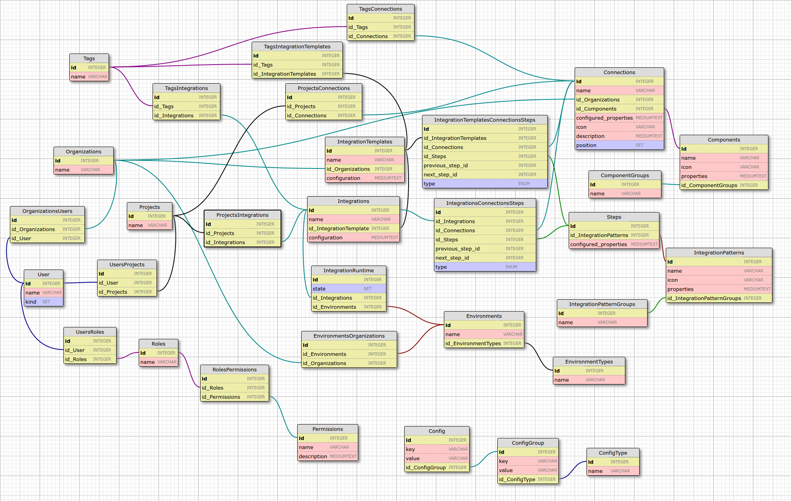

# Entity Relationships
We are in the process of creating a diagram (see below) for the Entity Relationships in iPaaS. Below is a description of we are currently developing. Please feel free to edit this document as necessary.

## Models/Entities:

- Connection
    - belongs to ConnectionType
    - has many Tags (many-to-many)
- ConnectionType
    - has many Connections
- Environment
    - belongs to an EnvironmentType
    - belongs to an Organization
    - has many IntegrationRuntimes
- EnvironmentType
    - has many Environments
- Integration
    - has one IntegrationTemplates (through JOIN IntegrationTemplatesIntegrations))
    - has many IntegrationRuntimes
    - has many Tags (many-to-many)
    - belongs to a User
- IntegrationRuntime
    - belongs to an Integration
    - belongs to an Environment
- IntegrationTemplate
    - has many Connections
    - has many Steps
    - has many Tags
- Organization
    - has many Connections
    - has many Environments
    - has many IntegrationTemplates
    - has many Users
- Permission
- Report (if we want them persisted to a hard disk)
	- belongs to many Organizations
    - belongs to many Users
- Role
- Step
    - belongs to a StepType
    - has many IntegrationTemplates (through JOIN IntegrationTemplateSteps)
- StepType
    - has many Steps
- Tag
    - has many Connections (many-to-many)
    - has many Integrations (many-to-many)
- User
    - belongs to many Organization
    - has many Integrations

<!-- TODO wanna keep this handy for now
- Connection
    - belongs to Organization
    - has many Tags (many-to-many)
- Environment (a place where integrations run)
    - has many Integration Runtime
- Integrations
    - belongs to an Organisation (whether by using recipe or not?)
    - has many Tags (many-to-many)
- Integration Runtime (a collection of integration containers in an Environment)
    - has an Integration
    - has an Environment in which it runs
    - has many Containers (process instances)
- Organization
    - has many Connections and Integrations
    - has many Users
    - has many Environments (Dev / Test / Staging / UAT)
- Reports (if we want them persisted to a hard disk)
    - belongs to User
- Settings
    - belongs to Organization
    - belongs to User
- Tags
    - has many Integrations (many-to-many)
    - has many Connections (many-to-many)
- User
    - belongs to Organization
    - has many Integrations
    - has many Reports (or should this be under Integrations instead?)
    - has many Settings
    -->

Again, this list may not be up-to-date, or may be under development. Please see the active list of models by viewing the [`src/models`](../src/models/index.js) file.

## Visual entity graph

