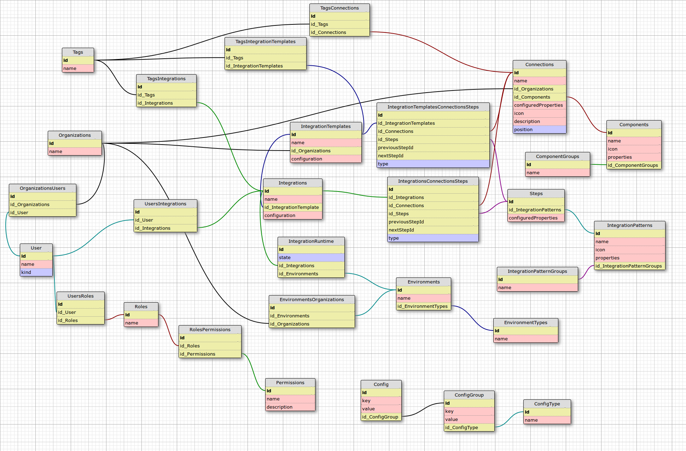

# Entity Relationships
We are in the process of creating a diagram (see below) for the Entity Relationships in iPaaS. Below is a description of we are currently developing. Please feel free to edit this document as necessary.

## Models/Entities:
- Organization
    - has a name
    - has many Connections
    - has many Integration Templates
    - has many Users
- User
    - has a name
    - belongs to many Organizations
    - has many Integrations
- Integration
    - has a name
    - has a configuration
    - has an Integration Template
    - has many IntegrationRuntimes
    - has many Tags
- IntegrationRuntime
    - has a state
    - has an Integration
    - has an Environment
- Integration Template
    - has a name
    - has a step order
    - has many Connections
    - has many Steps
    - has many Tags
- Connection
    - has a name
    - has an icon
    - has configured properties
    - has a position
    - has a description
    - has one ConnectionType
    - has many Tags
- Connection Type
    - has a name
    - has an icon
    - has properties
- Step
    - has configured properties
    - refers to a Step Type
- Step Type
    - has a name
    - has an icon
    - has properties
- Environment
    - has a name
    - has an EnvironmentKind
    - belongs to many Organizations
- EnvironmentKind
    - has a name
- Tag
  - has a name

<!-- TODO wanna keep this handy for now
- Connection
    - belongs to Organization
    - has many Tags (many-to-many)
- Environment (a place where integrations run)
    - has many Integration Runtime
- Integrations
    - belongs to an Organisation (whether by using recipe or not?)
    - has many Tags (many-to-many)
- Integration Runtime (a collection of integration containers in an Environment)
    - has an Integration
    - has an Environment in which it runs
    - has many Containers (process instances)
- Organization
    - has many Connections and Integrations
    - has many Users
    - has many Environments (Dev / Test / Staging / UAT)
- Reports (if we want them persisted to a hard disk)
    - belongs to User
- Settings
    - belongs to Organization
    - belongs to User
- Tags
    - has many Integrations (many-to-many)
    - has many Connections (many-to-many)
- User
    - belongs to Organization
    - has many Integrations
    - has many Reports (or should this be under Integrations instead?)
    - has many Settings
    -->

Again, this list may not be up-to-date, or may be under development. Please see the active list of models by viewing the [`src/models`](../src/models/index.js) file.

## Visual entity graph

